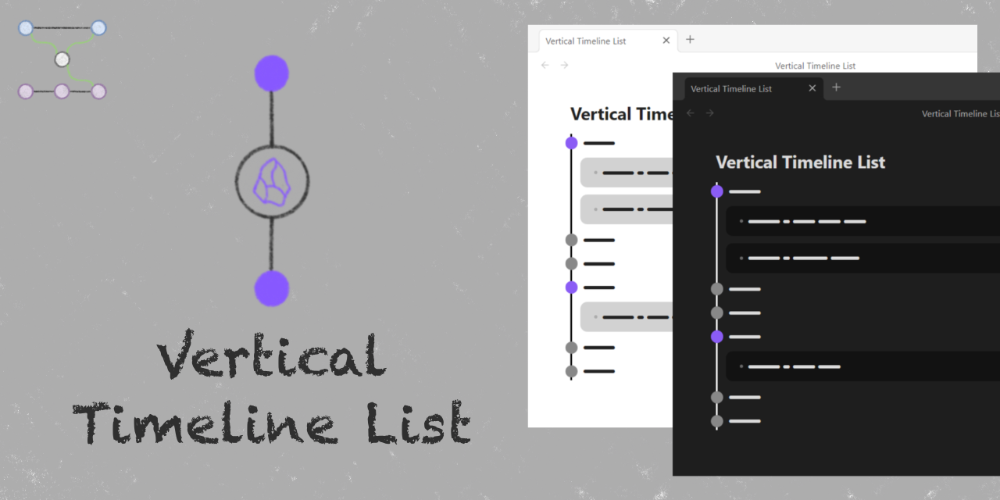
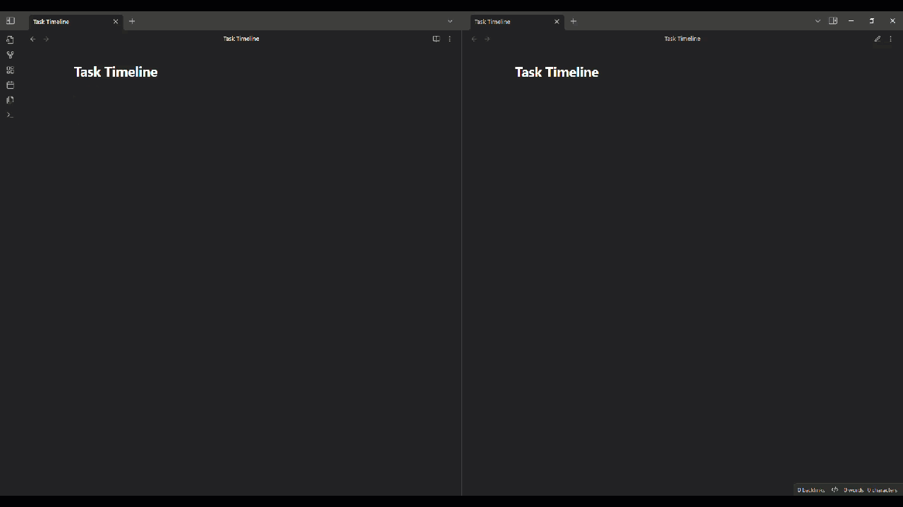
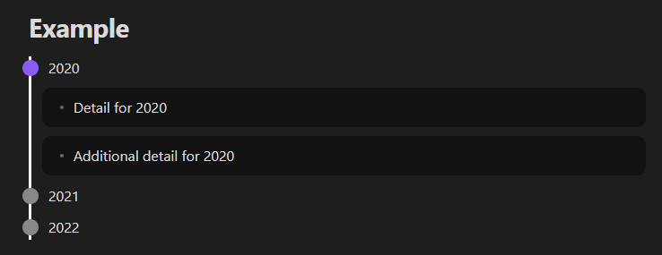

<p align="center">
  
</p>

<p align="center">
  
  
  
	
</p>

# Vertical Timeline List

An [Obsidian](https://obsidian.md/) plugin that utilizes task lists to create a timeline... or something like a timeline.



## Features

- **Timeline Rendering** — Any task list whose parent task has a `t` status (e.g. `- [t]`) is rendered as a vertical timeline in Reading View.
- **Customizable Spacing** — Adjust dot separation, line padding, and detail block spacing from the settings tab.
- **Theme-aware Colors** — Independent light- and dark-mode color values for the line, dots, hover state, and detail backgrounds. The active set switches automatically when Obsidian's theme changes.
- **Collapsible Dots** — Toggle whether timeline entries with details can be collapsed and expanded.

## Installation

### Obsidian Community Plugins

1. Open Obsidian and go to **Settings → Community plugins**.
2. If restricted mode is on, click **Turn on community plugins**.
3. Click **Browse** and search for **Vertical Timeline List**.
4. Click **Install**, then **Enable**.

### BRAT

BRAT installs plugins directly from their GitHub repository and auto-updates them on each release.

1. Install **BRAT** from **Settings → Community plugins → Browse** and enable it.
2. Open the command palette (`Ctrl+P` (Windows) or `Command+P` (macOS)) and run **BRAT: Add a beta plugin for testing**.
3. Enter the repository URL: `https://github.com/Jalad25/vertical-timeline-list`.
4. Choose whether to track the latest release or the latest commit, then select **Add Plugin**.
5. Open **Settings → Community plugins** and enable **Contact Note**.

To get future updates, run **BRAT: Check for updates to all beta plugins** from the command palette, or enable auto-update in BRAT's settings.

### Manual

1. Download `main.js`, `manifest.json`, and `styles.css` from the latest release.
2. In your vault, create the folder `.obsidian/plugins/vertical-timeline-list/` if it does not already exist.
3. Copy the downloaded files into that folder.
4. Open Obsidian, go to **Settings → Community plugins**, and enable **Vertical Timeline List**.

## Usage

A timeline is denoted by a task list whose parent task has a `t` status. Nested list items become the timeline's entries. Further nesting under each entry becomes its details.

For example:

```
# Example
- [t]
  - 2020
    - Detail for 2020
    - Additional detail for 2020
  - 2021
  - 2022
```

renders as:



> [!IMPORTANT]
> Add a space after the `[t]`. Without it, Obsidian does not recognize the line as a task and the timeline will not render.

## Settings Reference

### Spacing

| Setting | Description | Default |
|---|---|---|
| Dot separation | Vertical gap between dots on the line. | `10` px |
| Line padding | Left and right padding around the line. | `12` px |
| Dot details padding | Padding inside the detail block (all sides). | `10` px |
| Dot details top separation | Space above the detail block. | `10` px |
| Dot details bottom separation | Space below the detail block. | `10` px |

### Theme Colors

Each color has independent light- and dark-mode values. The active value applies whenever Obsidian's theme matches.

| Setting | Description | Light Default | Dark Default |
|---|---|---|---|
| Dot color | Dots without details. | `#888888` | `#888888` |
| Dot collapsible color | Dots with details. | `#8A5CF5` | `#8A5CF5` |
| Dot collapsible hover color | Hover ring on collapsible dots (only visible when **Dot collapsible** is on). | `#8A5CF5` | `#8A5CF5` |
| Line color | The vertical line itself. | `#000000` | `#ffffff` |
| Dot details background color | Background of each detail block. | `#8f8f8f67` | `#00000067` |

### Behavior

| Setting | Description | Default |
|---|---|---|
| Dot collapsible | When on, dots with details can be collapsed and expanded. | Off |

## Other Plugin Compatibility

Tested with:

- [Dataview](https://github.com/blacksmithgu/obsidian-dataview)
- [Tasks](https://github.com/obsidian-tasks-group/obsidian-tasks)

#### Dataview

Internal links into nested timeline items work normally, but Dataview's `TASK` query only highlights a navigated-to task when every date in the note is already expanded in Reading View. The collapsible-dot option is therefore off by default. If you turn it on, this Dataview-specific highlight behavior will not work as expected.

#### Tasks

No issues were observed when using the Tasks plugin alongside this plugin. To exclude the timeline parent task from Dataview `TASK` queries, register `t` as a custom task status in the Tasks plugin and filter on that status.

## Contributing

Contributions of all kinds are welcome!

See [CONTRIBUTING.md](CONTRIBUTING.md) for full guidelines.

## License

GNU Affero General Public License v3.0. See [LICENSE](LICENSE) for details.
