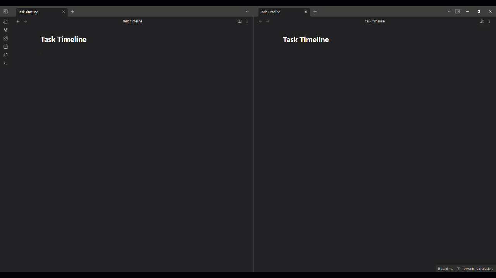

# Vertical Timeline List Plugin

An [Obsidian](https://obsidian.md/) plugin that utilizes task lists to create a timeline... or something like a timeline.



## Usage

Timelines are denoted using a task list with a 't' within the brackets. The dates of the timeline are then added as nested lists as well as their details.

For example, the following 
```
# Example
- [t]
  - 2020
    - Detail for 2020
    - Additional detail for 2020
  - 2021
  - 2022
```

shows as


## Compatibility

### Live Preview

Currently the plugin does not work when a note is in Live Preview. It only shows the timeline in Reading View.

### Plugins

The plugin has been tested with the following plugins:

- [Dataview](https://github.com/blacksmithgu/obsidian-dataview)
- [Tasks](https://github.com/obsidian-tasks-group/obsidian-tasks)

#### Dataview

Though internal links can be made to nested lists within the timeline and work properly, Dataview's `TASK` query will only highlight a task that is navigated to from the query when all dates in the notes are expanded in Reading View. This is why the collapsible option for Dates is off by default. 

If you wish to have the Dates expand and collapse, keep in mind that this specific feature with Dataview will not function as expected.

#### Tasks

No issues were ran into while using the Tasks plugin with this plugin. It is recommended you add `t` as a custom task status within the Tasks plugin in order to utilize the status within Dataview `TASK` queries to filter out the timeline task.